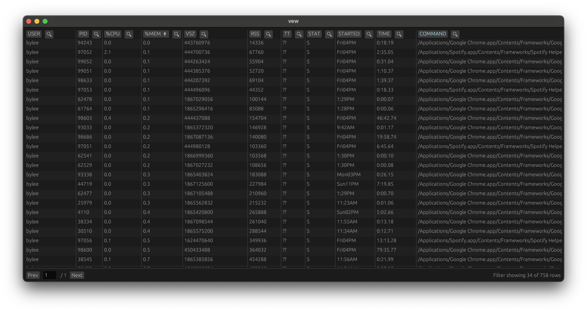
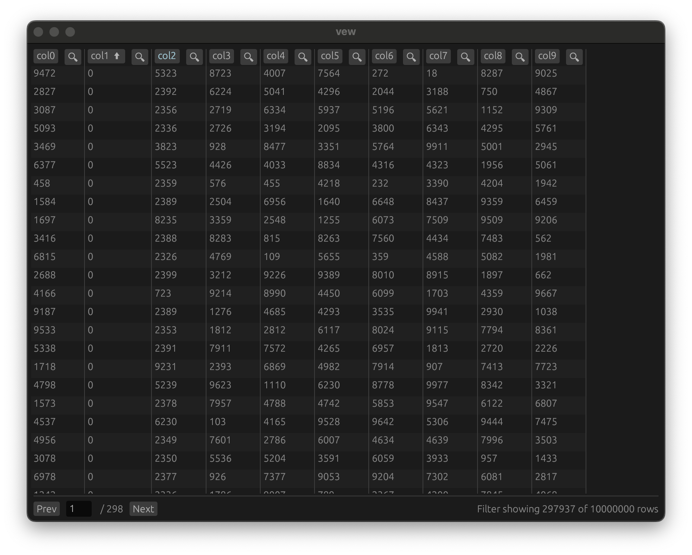
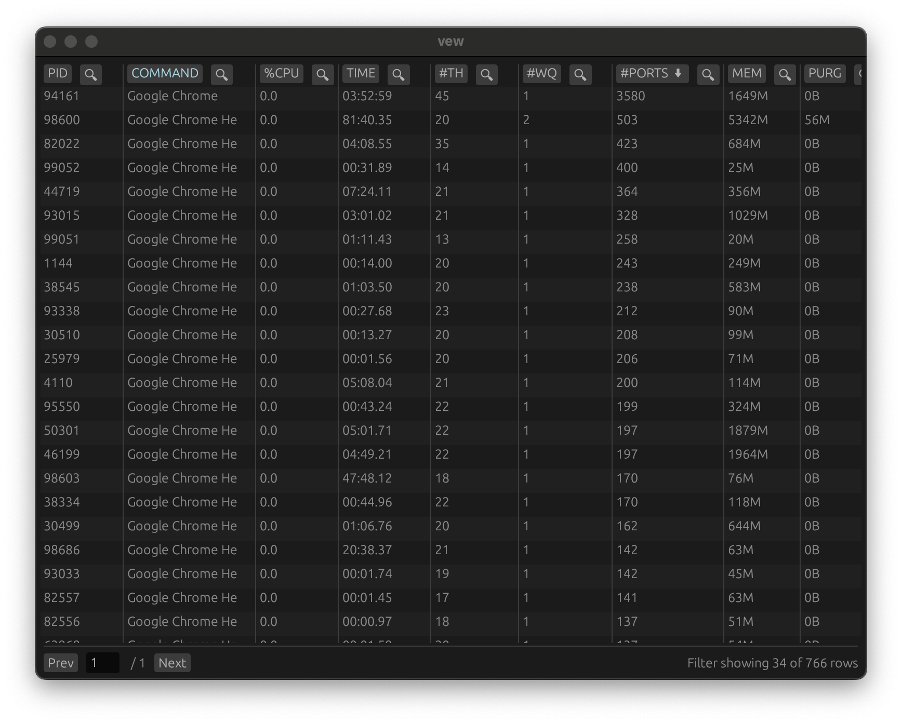
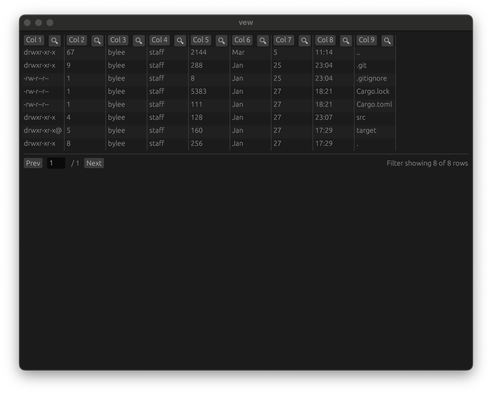
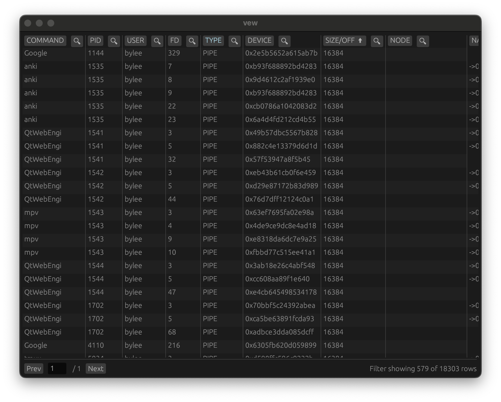
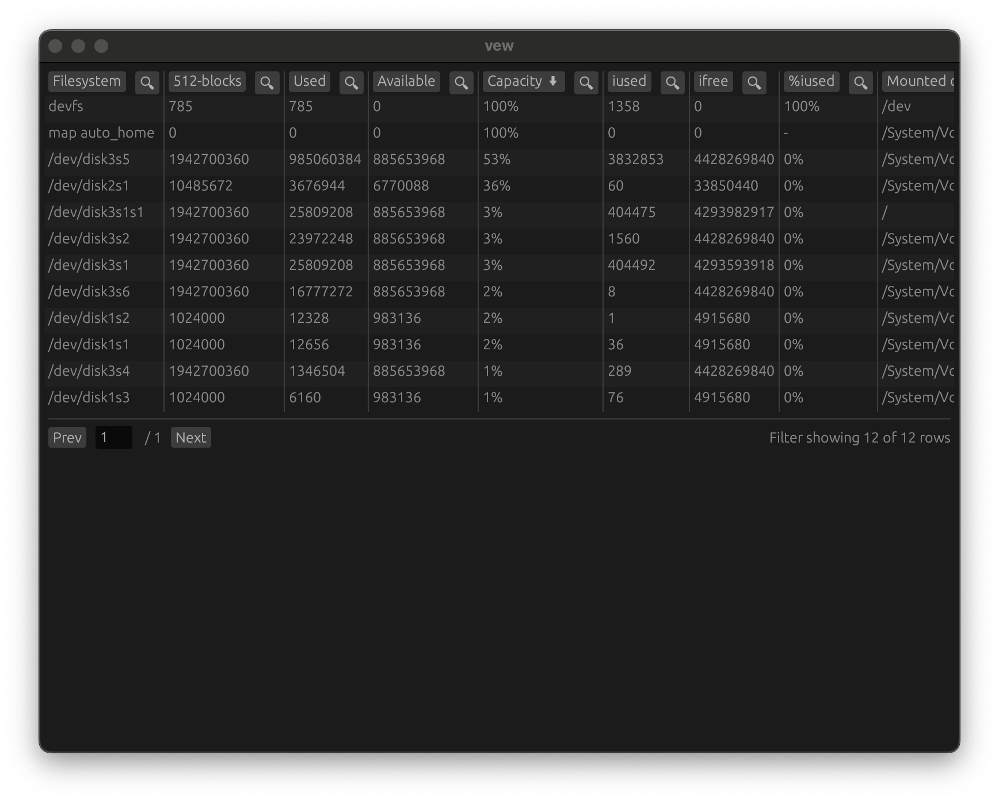

# `vew`: View textual tabular data ┬─┬  
`vew` is a quick way to view tabular data. `vew` supports terminal output from common unix programs (`ps`, `ls`, `lsof`, `df`, `netstat` etc) which produce "visually aligned tables" or delimiter separated data (e.g. CSVs) and outputs the table in an interactive (filterable, sortable, scrollable) graphical user interface.

Here's an example of viewing `ps` output with `ps aux | vew` filtered for Chrome processes and sorted ascending by memory usage (because low resource processes should get some love).



`vew` streams data for a relatively fast, responsive UI, and supports filtering and sorting of columns (including by byte strings). `vew` works for quickly navigating tables from a few rows to millions of rows.

The motivation is developers often may want to sort, filter, or navigate around otherwise static tables output to the terminal. Parsing the tables with `awk`/`grep` or using a command's specific CLI args (e.g. `ls -aln`, `ps aux --sort=%mem`) are certainly useful but each case may require different commands. `vew` is another tool which seeks to be a simple to use and generally applicable utility to do similar investigations. 

## Getting Started
`vew` can be installed as a Rust binary crate
```sh
cargo install vew
vew -h
```

## Example Usage (Delimited Files)

### View `csv` or other character delimited files
View a CSV file, filter and sort by colu`mns
```sh
cat data.csv | vew
```
The below example is relatively large with 10M rows and 10 columns, sorted ascending by one column and filtered by another for the digits "23". Locally, this loads in seconds and column sorts can be applied in seconds.



View the colon (`:`) delimited `/etc/passwd` file (`-p` to add column headers)
```sh
cat /etc/passwd | vew -d ':' -p
``` 

## Example Usage (tabular unix program output)
Note: `vew` uses heuristics to parse the text based table output of the following programs. While the heuristics may parse certain visually misaligned columns incorrectly, they should be correct in most situations. While `vew` is not a perfect tool, the goal is for it to be a useful tool.

### `top`/`ps`: filter by process name, sort by resource usage
`top` is a way to view process resource usage, except it typically provides metadata prior to the table, which makes it non trivial to identify the start of the table. Top output is typically like
```
Processes: 319 total, 2 running, 317 sleeping, 1479 threads 
...
Disks: 195160/5G read, 181254/4G written.

PID    COMMAND      %CPU TIME     #TH   #WQ  #PORT MEM   PURG   CMPRS  PGRP  PPID  STATE    BOOSTS  %CPU_ME %CPU_OTHRS UID  FAULTS   COW      MSGSENT   MSGRECV   SYSBSD   SYSMACH  CSW   PAGEINS IDLEW
1234   Safari       12.3 00:04.15 21    0    23    456M  0B     0B     1234  1     running  *0[0]   0.0    0.0     501  123456   7890     1122     3344    5567  89     0
```

You could run `top | tail -n +ROWS | ...` to skip the first `ROWS`, but that would require manual counting. 
`vew` provides some heuristics (toggled with `-i` (inferred header)) to determine which rows are likely to be headers. This often, but not always, works.

This displays the output of `top` in a tabular form, sorted by `PORTS` open descending and filtering from `Chrome` processes. `vew` attempts to intelligently infer column splits of data in rows despite the names having spaces (e.g. "Chrome Helper"). Note that `vew` can also sort by byte strings where applicable (e.g. `40G > 10Kib`).
```sh
# -l to only output sample, otherwise top polls the system resoures periodically
top -l 1 | vew -i 
```


`vew` can also be applied to `ps`, another way to view process resource usage
```sh
ps aux | vew
``` 

Note that there are some *limitations* on parsing the `TT` (controlling terminal) and `STAT` (process state) columns since they are often skewed. This should only affect a subset of rows.

### `ls`: filter by file name, sort by file size
Typical `ls` output looks like:
```sh
total 32
drwxr-xr-x  3 jdoe  staff  96 Mar  1 12:00 .
drwxr-xr-x  5 jdoe  staff 160 Feb 28 11:00 ..
-rw-r--r--  1 jdoe  staff  12 Mar  1 12:05 file.txt
```

Applying `vew`,
```sh
ls -al . | vew -p -i
``` 
where `-p` indicates column names should be added since `ls` does not give header names and `-i` uses heuristics to infer the header column (skipping the e first line of metadata).



Note that this also shows a *limitation* of `vew` because it is unable to discern that the three time related columns are one timestamp. Further, `vew` does not typed columns so it cannot sort the column by time, only by alphabetical order. In this scenario, the built in sort with `ls -lt` would be preferable.

### `lsof`/`netstat`: filter by file or network type
You may need to prefix with `unbuffer` (Mac) or `stdof -oL` (Linux) since `lsof` will block buffer (vs line buffer) for non tty outputs.  

Applying `vew`, 
```sh
lsof | vew
``` 
and then filtering for `PIPE` file types and sorting descending by the `PIPE` size gives



`netstat` a command that shows network connections, can also be visualized (note that `netstat` outputs multiple tables and `vew` expects output with only one table).
```sh
unbuffer netstat -p tcp | vew
```

### `df`/`du`: Sort file system/file resource usage
Note that `vew` sorting is numerical/string comparison, so using raw resource numbers (vs Gi, Mi) will give the most accurate sorting order.
```sh
df | vew
```
This shows `df` sorted by capacity of each file system



A related command, `du`, which outputs the disk space used by files and directories is also in a tabular format and can also be filtered (say for debug artificats) and sorted by size
```sh
du | vew -p
```

## Design
For all tables, `vew` streams all the data into memory across multiple threads to speed up load times for large tables or otherwise long running programs (e.g. `lsof` can quickly load many programs and file entries, but resolving the long tail of files can take some time). `vew` also uses the very useful `egui` crate to render the GUI, and in particular only renders the subset of the table that is viewable in the scroll area with pagination to minimize UI lag and scale to larger tables. In local tests, displaying a CSV with 1M rows and 100 columns can render, scroll, and filter fairly smoothly. One limitation is memory given `vew` will load the entire table in memory. However, note that filtering and sorting tables will cause the `egui` table view to rerender, will take time (several seconds for a table with 1M rows/100 cols or 10M rows/10 cols, for example).

Unless a delimiter is explicitly specified, `vew` infers the type of the input stream from the input data, selecting between either a csv or visually aligned table. 

For delimited files (e.g. CSVs), `vew` simply ensures all rows have the delimiter and sanity checks that the number of columns is constant throughout the dataset and uses the first row as a header and the remainder as data. 

For visually aligned tables, `vew` uses heuristics to identify table headers and columns. While `vew` cannot infer the layout of all possible tables, it tries to be robust to certain forms of white space in headers and data (i.e. not unnecessarily splitting headers or data), and also tries to infer which input line is the header, since some programs output metadata prior to the main tabular output (e.g. `netstat`, `top`) so the first row is not always the header. `vew` also tries to be robust to certain column misalignments (e.g. `ps aux` output). The implementation specifics can be seen in `inference.rs`, but the heuristics are relatively intuitive. 

For whitespace in headers, `vew` first preloads the first portion of the table so it can use index overlap with datum in each row to infer whether a header with whitespace is multiple entries or not. For whitespace in datum, the reverse is done but with the header text. `vew` also uses the collective span of data in that column from the header and row to infer the visual span of the column. In that span, `vew` does not split text with spaces into multiple columns and assumes it corresponds to the same column For inferring the start of a table (i.e. identifying the header), `vew` takes each row in turn and calculates the "intersection over min" metric of each candidate header and datum. If this crosses a threshold, then the row is likely a header and not metadata. `vew` also iteratively merges adjacent space-separated header elements to try to improve the this metric. This process is iterated until a row is found with a sufficiently high metric value.     

### Heuristic Limitations 
There are **limitations** to these heuristics and certain tables may not be loaded as a human would infer due to factors such as column misalignment or abnormal white spacing. Additionally, `vew` cannot intelligently group columns together without a shared header. 

For example, in `ls -al .` output shown above, view does not group the timestamp column into one column but instead splits it into multiple. In these scenarios, you can use other tools such `grep`, `awk`, or built in filtering/sorting CLI args in the respective commands if available. 

In most cases, `vew` should infer the correct table output, but double check the underlying data or use a different tool if there is a discrepancy. The goal of `vew` is to be a useful tool in addition to these other classic tools.